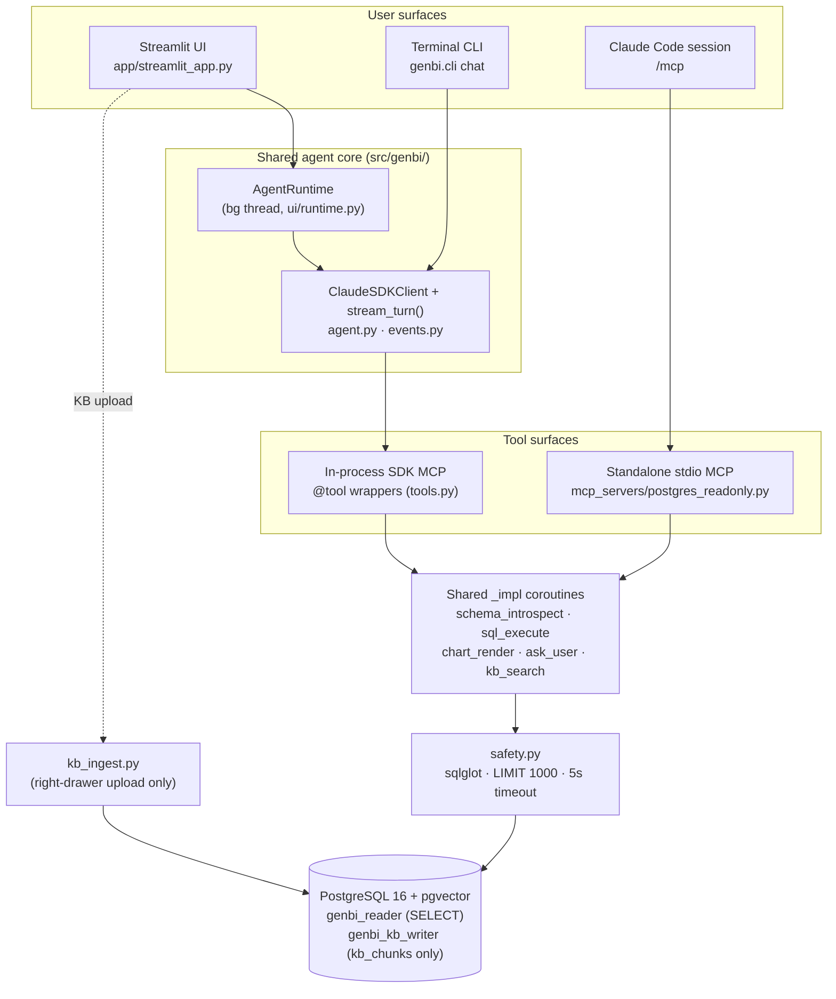
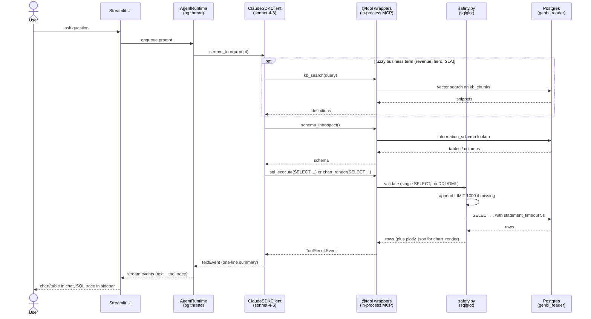

# Talk-to-Your-Data GenBI PoC

A natural-language → SQL → chart/table/summary chat over PostgreSQL.

## Architecture



The in-process path powers the CLI + Streamlit runtime (no IPC hop). The standalone stdio MCP exposes the same five tools to any Claude Code session in the repo via `.mcp.json`. Both paths share framework-agnostic `_<name>_impl` coroutines and the same read-only role. The Streamlit "Knowledge base" right-side drawer is the only non-seed write path — it routes through `kb_ingest.py` as a separate, narrowly-scoped role that can only touch `kb_chunks`.

### Main user flow

A typical question (`"How many high-priority tickets closed last month?"`) traverses the Streamlit UI → background runtime → agent → tools → Postgres, and streams typed events back to the UI:



The `ask_user` tool is the one branch off this path: when the question is genuinely ambiguous, the agent calls `ask_user(question, options)` and ends its turn — the user's next message carries the clarification, and the flow above resumes from `stream_turn`. The CLI follows the same sequence minus the `UI`/`AgentRuntime` hop (`genbi.cli` drives `stream_turn` directly).

## Stack

- **Python 3.12** + **uv** for env/deps
- **PostgreSQL 16** via Docker (host port `5433`)
- **`claude-agent-sdk`** (Python) — agent loop, `@tool`, in-process MCP
- **SQLAlchemy 2** + `psycopg[binary]` + **sqlglot** (SQL safety)
- **Typer** + **Rich** for the CLI; **Streamlit** + **Plotly** for the UI
- **Faker** for synthetic data; **pytest** + **ruff** for dev loop

## Prerequisites

- [Docker](https://www.docker.com/) (for Postgres)
- [uv](https://docs.astral.sh/uv/) (Python env/deps)
- Claude authentication — either an `ANTHROPIC_API_KEY` in `.env`, **or** an active `claude login` session (the CLI caches credentials in the macOS Keychain / Linux keyring). CI uses the API key; local dev can use either.

## Setup

```bash
# 1. Clone and install deps
git clone https://github.com/igorkaroza/talk-to-your-data-lab.git
cd talk-to-your-data-lab
uv sync --all-extras

# 2. Configure secrets
cp .env.example .env
# edit .env: set ANTHROPIC_API_KEY
# (DATABASE_URL / READONLY_DATABASE_URL / KB_WRITER_DATABASE_URL defaults are fine)

# 3. Start Postgres and load synthetic data
docker compose up -d postgres
uv run python -m genbi.seed

# 4. (Optional) Populate the knowledge base for kb_search
ollama pull nomic-embed-text
uv run python -m genbi.seed_kb
```

`genbi.seed` provisions three roles — `genbi_admin` (write, used only by the seed scripts), `genbi_reader` (SELECT-only, used by the agent / CLI / evals / app reads), and `genbi_kb_writer` (`SELECT/INSERT/DELETE` on `kb_chunks` only, used solely by the Streamlit KB-upload path) — and populates `sales_orders` (~2000 rows) and `tickets` (~1200 rows) with Faker. It also enables the `vector` extension and creates an empty `kb_chunks` table for RAG.

`genbi.seed_kb` is optional: it embeds the markdown files under `kb/` via a locally-running [Ollama](https://ollama.com/) (`nomic-embed-text`, 768 dims) and inserts them into `kb_chunks` with `source='corpus'`. The agent's `kb_search` tool retrieves from this corpus before writing SQL when a question uses fuzzy business terms ("hero product", "active customer", "revenue"). If Ollama is unreachable at runtime, `kb_search` returns an error field and the agent proceeds without RAG context — nothing else breaks. Re-running `seed_kb` refreshes only `source='corpus'` rows; user uploads (`source='upload'`) survive.

## Run the chat

```bash
uv run python -m genbi.cli chat
```

Example session:

```
you> How many high-priority tickets closed last month?
tool → schema_introspect()
tool → sql_execute   SELECT COUNT(*) FROM tickets WHERE priority = 'High' ...
23 high-priority tickets were closed last month.
```

Type `exit` or Ctrl-D to quit.

## Run the UI

```bash
uv run streamlit run app/streamlit_app.py
```

Opens a browser chat at `http://localhost:8501`. Ask about `sales_orders` or `tickets` — answers come back as tables or Plotly charts in the chat pane, with the full tool-call trace (SQL, result shapes) in the left **Tools** sidebar. Each chart and table result has a CSV download button and an "Explain this result" button that asks the agent for a 2–3 sentence summary without re-running SQL. Hero-prompt chips show on the empty state, above the chat input, to seed the conversation with rehearsed demo questions.

The right-side **Knowledge base** drawer (toggle from the right edge of the page) lets you upload `.md` or `.txt` files at runtime — each section is chunked, embedded via Ollama, and inserted into `kb_chunks` with `source='upload'`, so the next question's `kb_search` picks the new definitions up. The drawer also lists currently uploaded documents with their chunk counts and timestamps, and is where any `kb_search` snippets retrieved during a turn are surfaced. Try it with [`demo_key_accounts.md`](demo_key_accounts.md) (defines "VIP" / "strategic" / "key account") and then ask the VIP hero question. Re-uploading the same filename replaces only that document's prior upload rows; the curated corpus is untouched.

The agent runtime lives on a background thread (`src/genbi/ui/runtime.py`) so one `ClaudeSDKClient` survives Streamlit's per-interaction reruns — don't call `asyncio.run` from the app code.

## Evals

A structural regression suite lives in `evals/questions.yaml` (11 cases across both tables). Scoring is structural, not numeric — Faker data is noise, so we assert on tool-firing, SQL table references (parsed with `sqlglot`), chart type, and row-count thresholds instead of specific values.

```bash
uv run python -m evals.run_evals          # run full suite, print Rich pass/fail table
uv run python -m evals.run_evals -k q07   # single case
/run-eval                                 # same, with sql-reviewer fallback on failures
/new-question                             # interactively append + dry-run a new case
```

CI runs the suite on every PR via [`eval-regression.yml`](.github/workflows/eval-regression.yml), posts a Markdown matrix as a PR comment, and — once `.eval-baseline.json` is committed on main — fails the check if pass-rate drops more than 5pp vs. the baseline.

## Standalone MCP

`.mcp.json` registers a `postgres-readonly` stdio MCP server (`mcp_servers/postgres_readonly.py`) that exposes the same `schema_introspect` / `sql_execute` / `chart_render` / `ask_user` / `kb_search` tools as the in-process agent, routed through the same read-only role. Any Claude Code session opened in this repo picks it up via `/mcp` — handy for ad-hoc schema questions outside the main app.

The in-process `@tool` path stays the production surface for the CLI + Streamlit runtime (no IPC hop); the standalone MCP is the learning deliverable and the second tool surface.

## Meta-tooling (the "how Claude Code built this" surface)

Every primitive is wired to a concrete job in this repo — full map in [CLAUDE.md](CLAUDE.md#meta-tooling-map).

- **5 skills** (`.claude/skills/`) — `/seed-data`, `/pr-prep`, `/run-eval`, `/new-question`, `/add-tool`.
- **5 subagents** (`.claude/agents/`) — `developer`, `code-reviewer`, `test-writer`, `docs-writer`, `sql-reviewer`.
- **4 hooks** (`.claude/settings.json`) — ruff on Write/Edit; advisory `docs-writer` drift check on `tools.py` / `agent.py` / `pyproject.toml`; advisory `code-reviewer` on `git commit`; `pytest -q` on Stop.
- **4 CI workflows** (`.github/workflows/`) — `claude-review.yml` (AI PR review), `eval-regression.yml` (live eval gate), `nightly-doc-sync.yml` (auto-PR on docs drift), `issue-to-pr.yml` (label `claude-implement` → headless `developer` subagent → draft PR).
- **Standalone MCP** (`.mcp.json`) — `postgres-readonly` stdio server exposing the same five tools to any Claude Code session in the repo.

## Tests & lint

```bash
uv run pytest -q                          # unit + integration (integration skips if DB down)
uv run ruff format . && uv run ruff check .
```

## Safety rails

Every generated statement is parsed by `sqlglot` and rejected if it isn't a single `SELECT` / `WITH ... SELECT`; `INSERT|UPDATE|DELETE|DROP|ALTER|CREATE|GRANT|TRUNCATE|COPY` are blocked. A `statement_timeout = 5s` is pinned per query and `LIMIT 1000` is appended when absent. The runtime role has no write grants, so any violation of the above would fail at the database anyway.

The KB-upload path is the one place a Streamlit user can write to the database. It connects through a separate `genbi_kb_writer` role with `SELECT/INSERT/DELETE` on `kb_chunks` only — no `ALTER DEFAULT PRIVILEGES`, no other tables, no DDL. Uploads are capped at 1 MB / 100 chunks per file and wrapped in a 60 s ingest timeout. See [CLAUDE.md](CLAUDE.md#safety-rails-non-negotiable) for the non-negotiable list.

## Repo layout

```
src/genbi/        # package: db, seed, seed_kb, safety, tools, agent, events,
                  # kb, kb_ingest, cli, ui/
kb/               # business-glossary corpus (markdown, one ## H2 = one chunk)
tests/            # pytest suite (unit + integration)
app/              # Streamlit UI
evals/            # questions.yaml + run_evals.py
mcp_servers/      # postgres_readonly standalone stdio MCP
.claude/          # skills, subagents, hooks, settings
.github/workflows # claude-review, eval-regression, nightly-doc-sync,
                  # issue-to-pr
.mcp.json         # registers postgres-readonly stdio MCP
demo_key_accounts.md  # demo doc for the sidebar KB upload (VIP / strategic / key account)
CLAUDE.md         # project conventions — safety rails, commands, model defaults
docker-compose.yml
```
