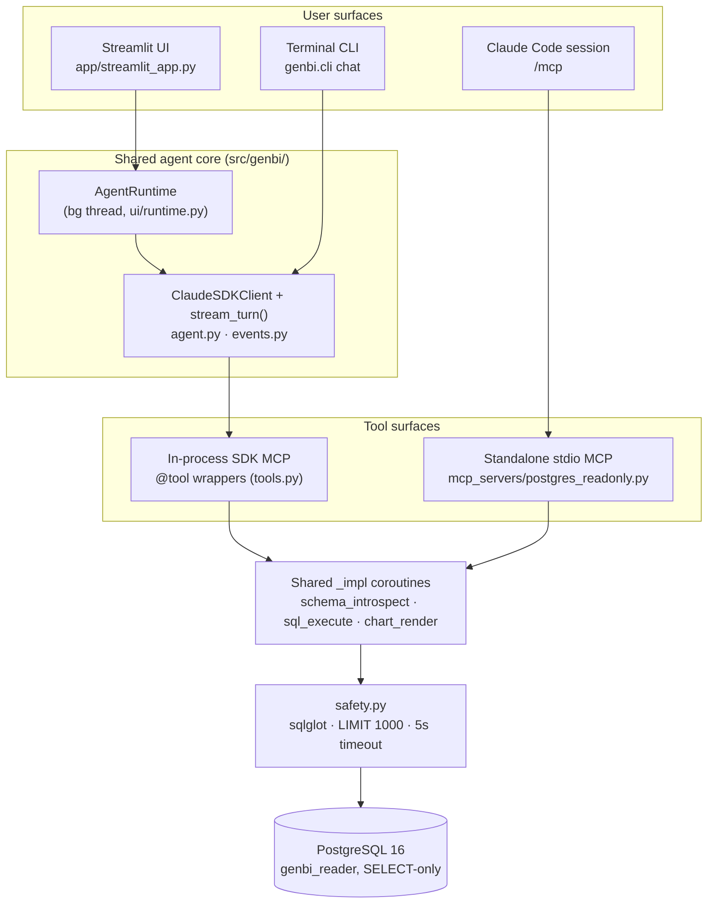

# Talk-to-Your-Data GenBI PoC

A natural-language → SQL → chart/table/summary chat over PostgreSQL.

## Architecture



The in-process path powers the CLI + Streamlit runtime (no IPC hop). The standalone stdio MCP exposes the same three tools to any Claude Code session in the repo via `.mcp.json`. Both paths share framework-agnostic `_<name>_impl` coroutines and the same read-only role.

## Stack

- **Python 3.12** + **uv** for env/deps
- **PostgreSQL 16** via Docker (host port `5433`)
- **`claude-agent-sdk`** (Python) — agent loop, `@tool`, in-process MCP
- **SQLAlchemy 2** + `psycopg[binary]` + **sqlglot** (SQL safety)
- **Typer** + **Rich** for the CLI; **Streamlit** + **Plotly** for the UI
- **Faker** for synthetic data; **pytest** + **ruff** for dev loop

## Prerequisites

- [Docker](https://www.docker.com/) (for Postgres)
- [uv](https://docs.astral.sh/uv/) (Python env/deps)
- Claude authentication — either an `ANTHROPIC_API_KEY` in `.env`, **or** an active `claude login` session (the CLI caches credentials in the macOS Keychain / Linux keyring). CI uses the API key; local dev can use either.

## Setup

```bash
# 1. Clone and install deps
git clone https://github.com/igorkaroza/talk-to-your-data-lab.git
cd talk-to-your-data-lab
uv sync --all-extras

# 2. Configure secrets
cp .env.example .env
# edit .env: set ANTHROPIC_API_KEY (DATABASE_URL / READONLY_DATABASE_URL defaults are fine)

# 3. Start Postgres and load synthetic data
docker compose up -d postgres
uv run python -m genbi.seed
```

`genbi.seed` provisions two roles — `genbi_admin` (write, used only by the seed script) and `genbi_reader` (SELECT-only, used by everything else) — and populates `sales_orders` (~2000 rows) and `tickets` (~1200 rows) with Faker.

## Run the chat

```bash
uv run python -m genbi.cli chat
```

Example session:

```
you> How many high-priority tickets closed last month?
tool → schema_introspect()
tool → sql_execute   SELECT COUNT(*) FROM tickets WHERE priority = 'High' ...
23 high-priority tickets were closed last month.
```

Type `exit` or Ctrl-D to quit.

## Run the UI

```bash
uv run streamlit run app/streamlit_app.py
```

Opens a browser chat at `http://localhost:8501`. Ask about `sales_orders` or `tickets` — answers come back as tables or Plotly charts in the chat pane, with the full tool-call trace (SQL, result shapes) in the sidebar. Chart and table results include a CSV download button.

The agent runtime lives on a background thread (`src/genbi/ui/runtime.py`) so one `ClaudeSDKClient` survives Streamlit's per-interaction reruns — don't call `asyncio.run` from the app code.

## Evals

A structural regression suite lives in `evals/questions.yaml` (12 cases across both tables). Scoring is structural, not numeric — Faker data is noise, so we assert on tool-firing, SQL table references (parsed with `sqlglot`), chart type, and row-count thresholds instead of specific values.

```bash
uv run python -m evals.run_evals          # run full suite, print Rich pass/fail table
uv run python -m evals.run_evals -k q07   # single case
/run-eval                                 # same, with sql-reviewer fallback on failures
/new-question                             # interactively append + dry-run a new case
```

CI runs the suite on every PR via [`eval-regression.yml`](.github/workflows/eval-regression.yml), posts a Markdown matrix as a PR comment, and — once `.eval-baseline.json` is committed on main — fails the check if pass-rate drops more than 5pp vs. the baseline.

## Standalone MCP

`.mcp.json` registers a `postgres-readonly` stdio MCP server (`mcp_servers/postgres_readonly.py`) that exposes the same `schema_introspect` / `sql_execute` / `chart_render` tools as the in-process agent, routed through the same read-only role. Any Claude Code session opened in this repo picks it up via `/mcp` — handy for ad-hoc schema questions outside the main app.

The in-process `@tool` path stays the production surface for the CLI + Streamlit runtime (no IPC hop); the standalone MCP is the learning deliverable and the second tool surface.

## Meta-tooling (the "how Claude Code built this" surface)

Every primitive is wired to a concrete job in this repo — full map in [CLAUDE.md](CLAUDE.md#meta-tooling-map).

- **7 skills** (`.claude/skills/`) — `/seed-data`, `/pr-prep`, `/run-eval`, `/new-question`, `/add-tool`, `/weekly-update`, `/daily-standup`.
- **6 subagents** (`.claude/agents/`) — `developer`, `code-reviewer` (Opus), `test-writer`, `docs-writer`, `sql-reviewer` (Opus), `release-notes`.
- **4 hooks** (`.claude/settings.json`) — ruff on Write/Edit; advisory `docs-writer` drift check on `tools.py` / `agent.py` / `pyproject.toml`; advisory `code-reviewer` on `git commit`; `pytest -q` on Stop.
- **5 CI workflows** (`.github/workflows/`) — `claude-review.yml` (AI PR review), `eval-regression.yml` (live eval gate), `nightly-doc-sync.yml` (auto-PR on docs drift), `release-notes.yml` (drafts GitHub Release on tag push), `issue-to-pr.yml` (label `claude-implement` → headless `developer` subagent → draft PR).
- **Standalone MCP** (`.mcp.json`) — `postgres-readonly` stdio server exposing the same three tools to any Claude Code session in the repo.

## Tests & lint

```bash
uv run pytest -q                          # unit + integration (integration skips if DB down)
uv run ruff format . && uv run ruff check .
```

## Safety rails

Every generated statement is parsed by `sqlglot` and rejected if it isn't a single `SELECT` / `WITH ... SELECT`; `INSERT|UPDATE|DELETE|DROP|ALTER|CREATE|GRANT|TRUNCATE|COPY` are blocked. A `statement_timeout = 5s` is pinned per query and `LIMIT 1000` is appended when absent. The runtime role has no write grants, so any violation of the above would fail at the database anyway. See [CLAUDE.md](CLAUDE.md#safety-rails-non-negotiable) for the non-negotiable list.

## Repo layout

```
src/genbi/        # package: db, seed, safety, tools, agent, events, cli, ui/
tests/            # pytest suite (unit + integration)
app/              # Streamlit UI
evals/            # questions.yaml + run_evals.py
mcp_servers/      # postgres_readonly standalone stdio MCP
docs/             # concept.md, demo-script.md, sdlc-slide.md, weekly-updates/
.claude/          # skills, subagents, hooks, settings
.github/workflows # claude-review, eval-regression, nightly-doc-sync,
                  # release-notes, issue-to-pr
.mcp.json         # registers postgres-readonly stdio MCP
CLAUDE.md         # project conventions — safety rails, commands, model defaults
docker-compose.yml
```
